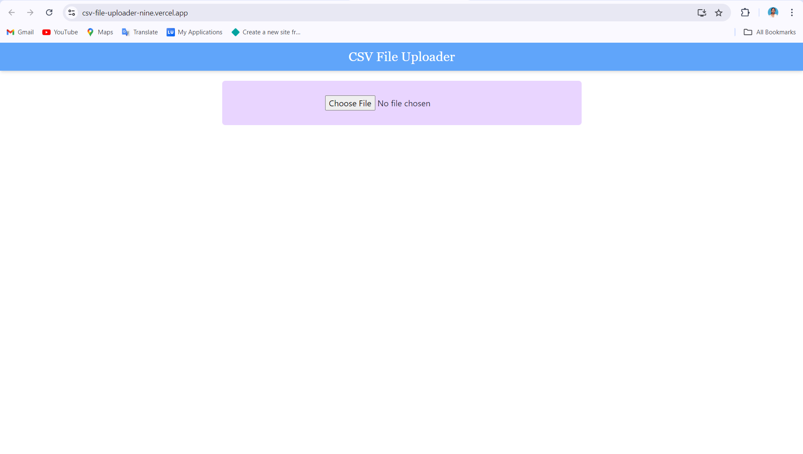
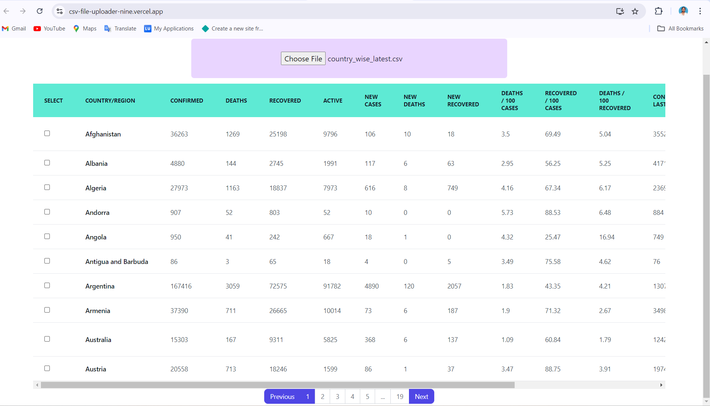
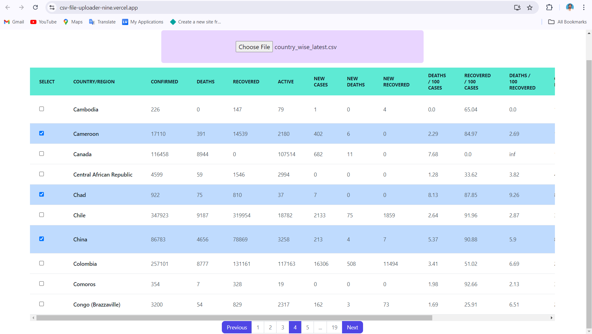

# Vara Frontend Coding Assignment

## Overview

This project is a React JS application designed to allow users to upload a CSV file and display it's content in the form of an interactive table. The table includes pagination, row and column selection features.

## Features

1. **CSV File Upload**
   - Users can upload CSV files through a file input component.

2. **Interactive Table**
   - **Display**: The table renders the parsed CSV data.
   - **Pagination**: Supports pagination controls to navigate through large datasets.
   - **Scrolling**: Adds horizontal scrolling if the table's width exceeds the viewport width.
   - **Row Selection** (Bonus): Clicking on any row will highlight that particular row.
   - **Column Selection** (Bonus): Allows users to select entire columns by clicking the column header.

3. **Table Styling**
   - Utilizes Tailwind CSS for styling table.
   - Ensures the table is visually appealing, modern, and user-friendly.

4. **Error Handling**
   - Handles errors for unsupported file formats and empty CSV files.

## Tech Stacks Used

1. Frontend Framework: React JS
2. CSS Framework: Tailwind CSS
3. File Handling: CSV parsing libraries called papaparse
4. State Management: React hooks for managing state
5. Pagination: Logic for calculating and displaying paginated data

## Screenshots

